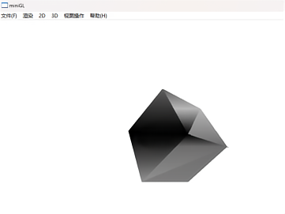

# MapRenderer-Cpp
This project implements a lightweight, portable map rendering engine using C++ and OpenGL. Designed without GPU dependency, the renderer supports real-time 3D terrain visualization, light modeling, and dynamic label management on standard office computers.

## Features
- Custom rendering pipeline with **CPU-only rendering**, supporting 60 FPS on basic terminals.
- Implements **Gouraud lighting** and **Z-buffer depth management** for realistic 3D scenes.
- **Efficient layer rendering** for more than 100,000 geographic features.
- **2D label layout engine** with dynamic avoidance and multi-scale visibility support.
- Supports loading of standard geographic data and 3D terrain files.

## Technologies
- **Language**: C++
- **Graphics**: OpenGL (no GPU acceleration)
- **Platform**: Cross-platform (tested on Windows)

## Screenshots & Demo

## Usage
To build and run:
g++ main.cpp -o map_renderer -lGL -lGLU -lglut
./map_renderer

## Status
This project was originally developed as a teaching & demonstration tool and continues to be optimized.

## License
MIT License
